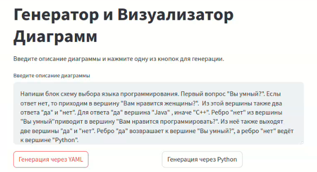
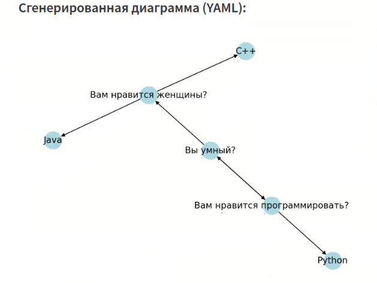

### Для запуска 

1) склонируйте репозиторий
```
git clone https://github.com/maksimlitvinov39kg/diagraimond.git
```
2) создайте виртуальное окружение под задачу
```
conda create --name diagraimond
```
3) Установите нужные зависимости

``` 
pip install openai streamlit -U langgraph langchain-community langchain-openai networkx matplotlib pyyaml python-dotenv
pip install httpx==0.27.2
```
4) перейдите в нужную папку
```
cd /second_version_pipeline
```
5) создайте файл .env, если его нет и добавьте туда ваш HF_API_KEY

``` 
HF_API_KEY = {YOUR_KEY}
```

6) запустте стримлит
```
streamlit run main.py
```

### Пример работы программы 

1) Ввод пользователя( может быть на любом языке формально/неформально)


2) Результат работы

3) Альтернатива


